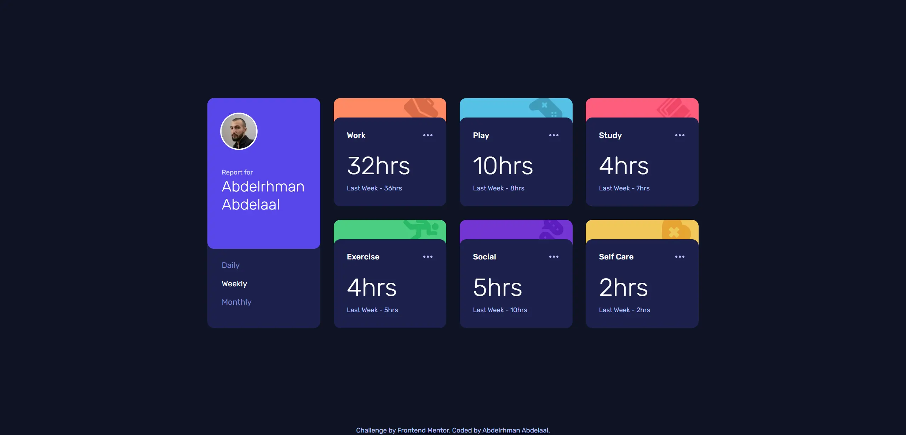

# Frontend Mentor - Time tracking dashboard solution

This is a solution to the [Time tracking dashboard challenge on Frontend Mentor](https://www.frontendmentor.io/challenges/time-tracking-dashboard-UIQ7167Jw). Frontend Mentor challenges help you improve your coding skills by building realistic projects.

## Table of contents

- [Overview](#overview)
  - [Screenshot](#screenshot)
  - [Links](#links)
- [My process](#my-process)
  - [Built with](#built-with)
  - [Design deviations](#design-deviations)
- [Author](#author)

## Overview

### Screenshot

### Links

- Solution URL: [GitHub](https://github.com/MrBlackvanta/time-tracking-dashboard)
- Live Site URL: [Cloudflare](https://time-tracking-dashboard.abdelrhman-ahmed8881.workers.dev)
- Mirror: [Netlify](https://vanta-time-tracking-dashboard.netlify.app)

## My process

### Built with

- [Next.js 16](https://nextjs.org/) (App Router, React Compiler, Turbopack)
- [React 19](https://react.dev/)
- [TypeScript](https://www.typescriptlang.org/) (strict)
- [Tailwind CSS v4](https://tailwindcss.com/)

### Design deviations

**Two text pairings fail WCAG AA and had to move.** Each ratio is measured against the backdrop
the text actually sits on, on rounded 8-bit channels. Both shipped values are the smallest step
that clears 4.5:1, keeping the design's hue and saturation.

|                        | on        | design    | contrast | shipped   | contrast |
| ---------------------- | --------- | --------- | -------- | --------- | -------- |
| Inactive timeframe tab | `#1C204B` | `#7078C9` | 3.84     | `#7D85CE` | **4.51** |
| "Report for"           | `#5747EA` | `#BBC0FF` | 3.46     | `#DADDFF` | **4.51** |

Neither qualifies for the 3:1 large-text allowance: the tabs are 18px Regular and the label is
15px. Every other pairing passes as drawn, so nothing else moved: white on Blue 6.01, white on
Dark Blue 15.47, Pale Blue on Dark Blue 8.91, and on the hover fill 10.46 and 6.03.

**Every colour in the style guide is one or two per channel off the paint in the design file.**
The guide rounds to HSL; the file holds the real values. Blue is `#5747EA` not `#5847EB`,
Desaturated blue `#7078C9` not `#6F76C8`, Pale Blue `#BBC0FF` not `#BDC1FF`, and so on for all
eleven. The tokens come from the file. The guide also lists none of the seven colours the design
actually needs beyond that: the six darker tints the activity artwork is painted in (`#D96C47`,
`#3F9CBB`, `#F04667`, `#29BA66`, `#5A1CBB`, `#E6A532`) and the card's hover fill `#33397A`.

**Every text node in the file is set to `line height: 100%`, which is Figma for `normal`.** So
the type tokens ship `line-height: normal` rather than a number. Rubik's own `normal` is 1.185,
confirmed two ways: the two-line name box is 95px at 40px type, and `next/font`'s generated
fallback carries the same metrics as ascent and descent overrides, which is why swapping the
webfont in shifts nothing. Letter-spacing is zero on every node, so there are no tracking tokens
to define.

**The design has no tablet frame**, so the three layouts are deliberate rather than a stretched
mobile: one column capped at 480 below 768, two columns capped at 696 from 768, and the design's
four-column 1110 grid from 1158.

**That last breakpoint is `72.375rem`, not Tailwind's `64rem`.** 1158 is the design's 1110 plus
its own 24px gutters, so the desktop columns are exactly the 255px the design draws from the
moment the layout applies, rather than a squeezed version of it. Switching at Tailwind's 1024
instead gives 221.5px columns, and the Monthly `103hrs` measures 169.2px of ink against the
161.5px those columns leave inside the card padding. Worth knowing when testing: Chrome
evaluates media queries against the viewport minus the scrollbar, and the two-column layout
scrolls, so in a scrollbar-ful window the switch lands at 1174.

**The page carries the Frontend Mentor attribution, which the mock has no room for.** The grid
therefore sits about 11px higher than the design at 1440 (242 against 253).

**The card menu control is 24x24 for WCAG 2.5.8**, which puts the glyph's right edge at 31.5px
instead of the 30px inset the design draws. The Work card's glyph is also drawn 16x5 where the
other five are 21x5; all six ship at 21x5.

**The activity artwork is placed by fitting, not by reading the file.** Four of the six shapes
are rotated, so the file reports their untransformed bounds. Rasterising each SVG and searching
scale and offset for best overlap against the painted JPG recovers natural size (scale 0.985 to
1.013, IoU 0.886 to 0.930) with a per-card offset off the top-right corner.

**The report is mine, not Jeremy Robson's**, so the avatar is my own photograph and the name is
my own. That name does not fit the design's type scale. `Abdelrhman` is one unbreakable
ten-character word measuring 221px at the design's 40px, against the 191px the desktop panel
leaves inside its 32px insets, so the desktop name ships at **34px** — the largest size that fits,
with 3.2px to spare at 35px overflowing. It still wraps to two lines as the design draws it, and
the purple card comes out 341px tall rather than 355.

Below the desktop breakpoint the name also needs help at the very small end. At 24px it wraps to
two lines from 375 down, which is fine, but by 320 the word alone is 132.6px against 124px of room
beside the 64px avatar, and being unbreakable it pushed the page into horizontal scroll. The size
token is therefore `min(1.5rem, 6.5vw)`: exactly the design's 24px at every width from 369 up,
easing to 20.8px at 320 where it has 9px of slack. The knock-on is that the mobile panel is 147px
rather than 133, and the text block being taller than the avatar now centres the avatar against
the text rather than the other way round. From 768 up the name fits on one line and the panel is
back to the design's height.

**The activity colour is a band, not the card's background.** The design draws it as a 255x160
shape on a 244px card, so it stops 84px short of the bottom, where the dark body has covered it
anyway. Painting it as the card's background instead puts two identical 15px radii on the same
bottom corners, and the outer colour bleeds through the inner one's antialiased edge as a
one-pixel hairline that the design does not have. The mobile frame does stack them, both shapes
being the full 160, which Figma renders cleanly and a browser does not, so the band ships as a
strip at every width.

**The hours figures count up, which the design does not specify.** Each one animates from zero on
load and tweens between values when the timeframe changes, 900ms and 500ms, both ease-out. It
needs no JavaScript: `--hours` is a registered `@property` integer, so it interpolates, and the
number itself is a counter (`counter-reset` on the element, `content: counter(hours)` in a
`::before`) with the same `:has()` rules that swap the labels feeding it the selected timeframe's
value. Both are dropped under `prefers-reduced-motion`. The cost of generated content is that it
cannot be selected or found with Ctrl+F, so the animated figure is `aria-hidden` and the real
value ships as visually hidden text on the previous-period line, which reads as
"32hrs. Last Week - 36hrs".

**The `Desktop - Active` frame stacks a discarded variant under every card**, all of it flagged
visible: lighter strips (`#FB9D7D`, `#7FCAE3`, `#E13556`), artwork blown up to 111 to 122px,
Rubik Black titles, and values truncated to `32hr`, `10hr`, `4hr`. It is not the hover state.
The card strips are pixel-identical between `desktop-design.jpg` and `active-states.jpg`, so the
real states are the three the JPG shows: card body to `#33397A`, menu glyph to white, inactive
tab label to white.

**The design's mobile Play card reads "Last Week - 36hrs"**, which is the Work card's value
pasted in. `data.json` says 8, and that is what ships.

**Switching timeframe uses no JavaScript at all.** It is a native radio group with a visually
hidden legend, `peer-checked` for the label styling, and one `:has()` rule that hides the two
timeframes that are not selected. Written as "hide the others" rather than "show the one" so
that a browser without `:has()` shows all three values instead of none.

**No scroll reveals.** At 1440 the document is 1024px tall in a 1024px viewport, so there is
nothing to reveal.

**One line wraps below 338px.** On Monthly at 320, the Work card's "Last Month - 128hrs" needs
241.5px against 224px of content width and takes two lines. Card heights stay uniform, because
the wrapped label is still shorter than the hours figure beside it.

## Author

- UpWork - [Abdelrhman Abdelaal](https://upwork.com/freelancers/~01f0a9479696b61f49)
- Frontend Mentor - [@MrBlackvanta](https://www.frontendmentor.io/profile/MrBlackvanta)
- LinkedIn - [Abdelrhman Abdelaal](https://www.linkedin.com/in/abdelrhman-vanta/)
